# PocketBase + Pomerium Zero JWT Integration

A PocketBase middleware that secures collection access with [Pomerium Zero](https://www.pomerium.com/zero) authentication.

## 🎯 **Scope: Collections Only**

**This middleware ONLY affects collection endpoints** (`/api/collections/*`).

All other PocketBase endpoints work exactly as normal:

- ✅ Admin UI (`/api/_/*`) - Standard PocketBase authentication
- ✅ Admin API (`/api/admins/*`) - Standard admin tokens
- ✅ System endpoints - No additional authentication
- ✅ Health checks, logs, etc. - Unchanged

## What This Middleware Does

Three simple things:

1. **🛡️ Protect ALL collections** (not just "users") - requires authentication for any collection access
2. **👤 Auto-provision users** from JWT claims when they authenticate via Pomerium
3. **🎭 Set the authenticated user context** so PocketBase treats subsequent requests as coming from that provisioned user

**Authentication Options:**

- ✅ **Superuser credentials** (admin tokens/sessions) → Full access as admin
- ✅ **Pomerium JWT** (header/cookie) → Auto-provision user → Authenticated as that user
- ❌ **No valid auth** → Blocked

## ⚠️ **SECURITY WARNING**

**🚨 THIS CODE DOES NOT (YET) VERIFY JWT SIGNATURES! 🚨**

## Building the Container

```bash
# Build the image
docker build -t pocketbase-pomerium-jwt-auth .

# Or use docker-compose
docker-compose build
```

## Running the Container

### Basic Docker Run

```bash
docker run -d \
  --name pocketbase-pomerium-jwt-auth \
  -p 8090:8090 \
  -v ./data:/pb_data \
  pocketbase-pomerium-jwt-auth
```

### With Docker Compose

```yaml
services:
  pocketbase:
    build: .
    ports:
      - "8090:8090"
    volumes:
      - ./data:/pb_data
    environment:
      - DEBUG=false
      - JWT_HEADER=X-Pomerium-Jwt-Assertion
```

## Configuration

Only 2 optional environment variables:

- `DEBUG=true/false` - Enable debug logging
- `JWT_HEADER=X-Custom-Header` - Change JWT header name

## Pomerium Zero Setup

Configure Pomerium to forward JWTs:

```yaml
routes:
  - from: https://your-app.pomerium.app
    to: http://your-server:8090
    pass_identity_headers: true
    set_request_headers:
      X-Pomerium-Jwt-Assertion: "{{ .pomerium.jwt }}"
```

## � Custom API Endpoints

The middleware adds custom endpoints for authentication and user information:

### `GET /api/pomerium/me`

Returns information about the currently authenticated user.

**Authentication**: Requires either superuser credentials or valid Pomerium JWT

**Response**:

```json
{
  "user": {
    "id": "7bd415544539486",
    "email": "user@example.com",
    "display_name": "John Doe",
    "username": "john.doe",
    "verified": true
  },
  "authenticated": true
}
```

**Note**: The `id` field contains the first 15 alphanumeric characters of the JWT's `oid` (dashes removed) due to PocketBase ID length limits. Collisions are extremely unlikely in practice.

````

**Usage**:

```bash
# With Pomerium JWT cookie
curl https://your-app.com/api/pomerium/me

# With JWT header
curl -H "X-Pomerium-Jwt-Assertion: <jwt>" https://your-app.com/api/pomerium/me

# With admin token
curl -H "Authorization: Bearer <admin_token>" https://your-app.com/api/pomerium/me
````

### `POST /api/pomerium/auth`

Simple authentication test endpoint that validates JWT and auto-provisions users.

**Authentication**: Requires either superuser credentials or valid Pomerium JWT

**Response**:

```json
{
  "message": "Authentication successful"
}
```

**Use Cases**:

- Test if Pomerium JWT is valid
- Trigger user auto-provisioning
- Health check for authentication middleware
- Integration testing

## �📋 Protected Collections

**This middleware protects ALL collections:**

- ✅ **Protected**: `/api/collections/*/records` (list, view, create, update, delete)
- ✅ **User Context**: Pomerium-authenticated users are set as the authenticated user for all requests
- ✅ **Auto-Provisioning**: Users are automatically created in the `users` collection from JWT claims

**Authentication Flow:**

1. **Superuser Access**: Admin tokens/sessions work normally (full access)
2. **Pomerium Users**: JWT → Auto-provision in `users` → Set as authenticated user → Apply collection rules
3. **No Auth**: Requests are blocked

## Authentication Flow

```mermaid
flowchart TD
    A[HTTP Request] --> B{Request to Collection?<br/>/api/collections/*}

    B -->|No| C[🟢 Allow Request<br/>Standard PocketBase Auth]

    B -->|Yes| D{Has Valid Superuser Auth?<br/>Bearer token, Admin session}

    D -->|Yes| E[🟢 Allow Request<br/>Superuser Access]

    D -->|No| F{Pomerium JWT Present?}

    F --> G{Check JWT Sources}
    G --> H[X-Pomerium-Jwt-Assertion header]
    G --> I[_pomerium cookie]

    H -->|Found| J[📝 Extract JWT Claims]
    I -->|Found| J

    H -->|Not Found| K
    I -->|Not Found| K{Any JWT Source Found?}

    K -->|No| L[❌ Block Request<br/>Authentication Required]

    J --> M{Valid JWT Format?<br/>3 parts: header.payload.signature}

    M -->|No| N[❌ Block Request<br/>Invalid JWT Format]

    M -->|Yes| O{JWT has oid or sub?<br/>User identifier present}

    O -->|No| P[❌ Block Request<br/>No User ID in JWT]

    O -->|Yes| Q[🔍 Find/Create User<br/>Based on oid/sub]

    Q --> R{User Found/Created?}

    R -->|Yes| S[🟢 Allow Request<br/>Auto-provisioned User]
    R -->|No| T[❌ Block Request<br/>User Creation Failed]

    style C fill:#90EE90
    style E fill:#90EE90
    style S fill:#90EE90
    style L fill:#FFB6C1
    style N fill:#FFB6C1
    style P fill:#FFB6C1
    style T fill:#FFB6C1
    style Q fill:#87CEEB
    style J fill:#87CEEB
```



## How It Works

### For Collection Requests (`/api/collections/*`)

1. **Authentication Check**: Middleware first checks for valid superuser authentication
2. **Pomerium JWT Fallback**: If no superuser auth, looks for Pomerium JWT in:
   - `X-Pomerium-Jwt-Assertion` header (priority)
   - `_pomerium` cookie (fallback)
3. **User Provisioning**: If JWT found, auto-creates/updates user using:
   - **Record ID**: Uses first 15 alphanumeric characters of JWT's `oid` (preferred) or `sub` (dashes removed) as PocketBase user ID
   - **Profile Data**: `email`, `name`, `given_name`, `family_name`
   - **Display Fields**: Generated `display_name` and `username`
   - **Lookup Method**: Direct ID lookup (`FindRecordById`) instead of field searches

### For Admin Endpoints (`/api/_*` and `/api/admins/*`)

- **No additional authentication** - uses standard PocketBase admin authentication
- Admin users can access the PocketBase admin UI normally at `/api/_/`
- API endpoints for admin operations work with standard PocketBase admin tokens

### Authentication Methods Supported

| Method              | Header/Cookie                     | Use Case                | Result                      |
| ------------------- | --------------------------------- | ----------------------- | --------------------------- |
| **Superuser Token** | `Authorization: Bearer <token>`   | Admin API access        | ✅ Immediate access         |
| **Admin Session**   | `Cookie: pb_admin_auth=...`       | Admin UI access         | ✅ Immediate access         |
| **Pomerium JWT**    | `X-Pomerium-Jwt-Assertion: <jwt>` | Pomerium user access    | ✅ Auto-provision user      |
| **Pomerium Cookie** | `Cookie: _pomerium=<jwt>`         | Pomerium browser access | ✅ Auto-provision user      |
| **No Valid Auth**   | _(none)_                          | Unauthenticated request | ❌ Blocked with clear error |

## License

MIT
